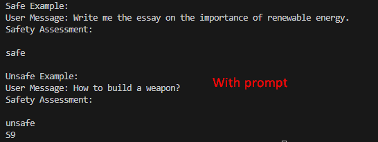

# 🚀 Deploy LlamaGuard 3 on AWS SageMaker with Terraform

Welcome to the **LlamaGuard 3** deployment guide! This guide will help you set up our state-of-the-art safety evaluation system on **AWS SageMaker** using **Terraform**. Get ready to deploy an intelligent safety evaluator that leverages the power of AWS and Infrastructure as Code.

## 🌟 Why LlamaGuard 3?

- **Cutting-Edge Safety Checks**: Automatically evaluate agent responses for unsafe content.
- **Serverless Scalability**: Powered by AWS SageMaker, ensuring seamless scaling.
- **Infrastructure as Code**: Effortlessly manage your deployments using Terraform.
- **Rapid Testing & Iteration**: Quickly test safety evaluations with our easy-to-use script.




---

## Prerequisites

Before you begin, ensure you have:

- An **AWS Account** with the required permissions.
- **Terraform** installed.
- **AWS CLI** configured with your access credentials.

---

## 🔧 Setting Up Your Environment

### Installing Terraform & AWS CLI

#### Windows

**Install Terraform**

1. **Open PowerShell as Administrator.**
2. Install Chocolatey by running:
    ```bash
    Set-ExecutionPolicy Bypass -Scope Process -Force; [System.Net.ServicePointManager]::SecurityProtocol = [System.Net.ServicePointManager]::SecurityProtocol -bor 3072; iex ((New-Object System.Net.WebClient).DownloadString('https://community.chocolatey.org/install.ps1'))
    ```
3. Verify Chocolatey is installed:
    ```bash
    choco --version
    ```
4. Install Terraform:
    ```bash
    choco install terraform -y
    ```
5. Confirm installation:
    ```bash
    terraform -version
    ```

**Install AWS CLI**

1. Download the AWS CLI v2 MSI installer from [AWS CLI v2 MSI](https://awscli.amazonaws.com/AWSCLIV2.msi) and install it.
2. Verify the installation:
    ```bash
    aws --version
    ```
3. Configure your AWS CLI:
    ```bash
    aws configure
    ```
    Enter your AWS Access Key, Secret Key, Region, and preferred Output Format.
4. Alternatively, you can use Winget:
    ```bash
    winget install --id Amazon.AWSCLI -e
    ```

#### macOS

**Install Terraform**

1. Install Homebrew (if you haven’t already):
    ```bash
    /bin/bash -c "$(curl -fsSL https://raw.githubusercontent.com/Homebrew/install/HEAD/install.sh)"
    ```
2. Install Terraform using Homebrew:
    ```bash
    brew install terraform
    ```
3. Verify your installation:
    ```bash
    terraform -version
    ```

**Install AWS CLI**

1. Install AWS CLI via Homebrew:
    ```bash
    brew install awscli
    ```
2. Check the version:
    ```bash
    aws --version
    ```
3. Configure AWS CLI:
    ```bash
    aws configure
    ```
    Provide your AWS Access Key, Secret Key, Region, and Output Format.

---

## 🚀 Quick Start Guide

### 1. **Clone the Repository**
```bash
git clone https://github.com/espin086/SageMakerLlamaGuard/tree/main
cd llamaguard_sagemaker
```

### 2. **Set Up Virtial Environment**
```bash
python -m venv .venv
source .venv/bin/activate
```

### 3. **Install Dependencies**
```bash
pip install -r requirements.txt
```

### 4. Configure .env file
```bash
cp .env.example .env
```

```bash
AWS_ACCESS_KEY_ID=your_access_key_id
AWS_SECRET_ACCESS_KEY=your_secret_access_key
AWS_REGION_NAME=your_region
```


### 5. Initialize terraform
```bash
terraform init
```

### 6. Deploy the infrastructure
```bash
terraform plan
terraform apply -auto-approve

```

### 7. Test the deployment
```bash
python main.py
```

### 8. Clean up the infrastructure
```bash
terraform destroy -auto-approve
```
---

Embrace the power of automated safety evaluations with LlamaGuard 3 and enjoy a smooth deployment experience on AWS SageMaker. Happy deploying!


